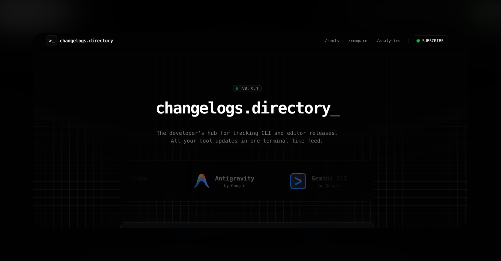

# Changelogs.directory



A curated aggregator of changelogs for CLI developer tools. Track what's new in Claude Code, Cursor, Codex, Windsurf, Gemini CLI, and more — all in one place.

**Live at [changelogs.directory](https://changelogs.directory)**

## Why

Keeping up with AI coding tools is exhausting. Each has its own blog, changelog format, and release cadence. This project aggregates them into a single, searchable directory with consistent formatting, weekly digests, and a comparison page.

## Stack

- **Framework**: [TanStack Start](https://tanstack.com/start) (React 19, SSR)
- **Database**: PostgreSQL + [Prisma](https://prisma.io)
- **Styling**: Tailwind CSS v4 + [shadcn/ui](https://ui.shadcn.com)
- **Background Jobs**: [Trigger.dev](https://trigger.dev) (ingestion pipelines)
- **Email**: [Resend](https://resend.com) + React Email
- **Analytics**: [PostHog](https://posthog.com)

## Architecture

```
                          ┌─────────────────────┐
                          │       Browser        │
                          └──────────┬──────────┘
                                     │
                          ┌──────────▼──────────┐
                          │      Dokploy         │
                          │  TanStack Start SSR  │
                          └──┬──────────────┬───┘
                             │              │
                  ┌──────────▼───┐   ┌──────▼──────┐
                  │  PostgreSQL  │   │ Upstash Redis│
                  │   (Prisma)   │   │   (Cache)    │
                  └──────────▲───┘   └──────────────┘
                             │
              ┌──────────────┴──────────────────┐
              │       Trigger.dev Workers        │
              │                                  │
              │  Ingestion Pipeline (every 6h):  │
              │  FETCH → PARSE → FILTER →        │
              │  ENRICH (Gemini AI) → UPSERT     │
              │                                  │
              │  Tools: Claude Code, Cursor,     │
              │  Codex, Windsurf, Gemini CLI,    │
              │  OpenCode, Antigravity           │
              │                                  │
              │  Weekly Email Digest:             │
              │  Resend + React Email             │
              └──────────────────────────────────┘
```

## Getting Started

```bash
# Install dependencies
pnpm install

# Set up environment
cp .env.example .env
# Fill in the required values (see docs/guides/environment-variables.md)

# Run dev server
pnpm dev
```

## Documentation

Comprehensive docs live in [`docs/`](docs/README.md), covering:

- [Adding a new tool](docs/guides/adding-a-tool.md)
- [Environment variables](docs/guides/environment-variables.md)
- [Database schema](docs/reference/database-schema.md)
- [Ingestion pipeline](docs/reference/ingestion-pipeline.md)
- [Design system](docs/design/design-rules.md)
- [Testing](docs/guides/testing.md)
- [Deployment](docs/guides/deployment.md)

## Contributing

See [CONTRIBUTING.md](CONTRIBUTING.md) for setup instructions and guidelines.

## License

[MIT](LICENSE)
