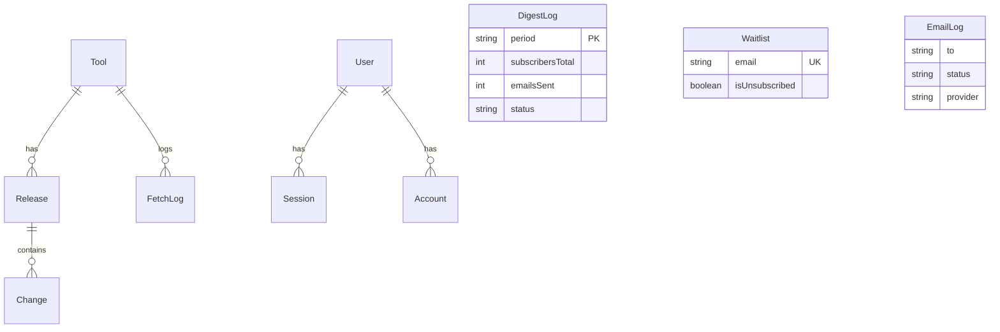

# Database Schema Design

## Overview

This document describes the complete database schema for Changelogs.directory, a platform that tracks, aggregates, and presents changelog information for CLI developer tools.

### Design Goals

- **Flexible source ingestion**: Support multiple changelog formats (CHANGELOG.md, GitHub Releases, RSS feeds, custom APIs)
- **Efficient querying**: Optimized for common queries (latest releases, filters by type/platform, search)
- **Change detection**: Track what's new without re-fetching unchanged data
- **Observability**: Log all ingestion jobs for debugging and monitoring
- **Future-proof**: Easy to add new tools and source types without schema changes
- **Feed generation**: Support RSS/Atom feeds per tool and globally

---

## Schema Models

### Core Models

#### Tool
Represents a developer tool (e.g., Claude Code, Cursor).

- `id`: CUID (PK)
- `slug`: URL-friendly identifier (unique)
- `name`: Display name
- `vendor`: Company/Organization name
- `sourceType`: Enum (CHANGELOG_MD, GITHUB_RELEASES, RSS_FEED, CUSTOM_API)
- `sourceUrl`: Primary source for fetching updates
- `lastFetchedAt`: Timestamp of last successful sync

#### Release
A specific version of a tool.

- `id`: CUID (PK)
- `toolId`: FK to Tool
- `version`: Version string (e.g., "v1.2.0")
- `releaseDate`: Official release date
- `publishedAt`: When it was detected/published in our system
- `isPrerelease`: Boolean (beta/alpha/rc)
- `headline`: LLM-generated one-line summary (max 140 chars)
- `contentHash`: Hash of raw content for change detection

#### Change
An individual item within a release.

- `id`: CUID (PK)
- `releaseId`: FK to Release
- `type`: Enum (FEATURE, BUGFIX, IMPROVEMENT, BREAKING, SECURITY, etc.)
- `title`: Short description of change
- `isBreaking`: Boolean flag
- `isSecurity`: Boolean flag

### Ingestion & Monitoring

#### FetchLog
Audit trail for every ingestion run.

- `status`: Enum (PENDING, IN_PROGRESS, SUCCESS, FAILED, PARTIAL)
- `releasesFound/New/Updated`: Metrics
- `duration`: Execution time in ms

#### DigestLog
Weekly email digest tracking.

- `period`: ISO week identifier (e.g., "2026-W02")
- `subscribersTotal`: Snapshot of recipient count
- `emailsSent/Failed/Bounced`: Delivery metrics
- `releasesIncluded`: Content metric

#### EmailLog
Transactional email history (signups, etc.).

- `to`: Recipient email
- `status`: Delivery status (sent, delivered, bounced)
- `provider`: Service used (Resend, ZeptoMail)

### User & Auth (Better Auth)

Standard Better Auth models: `User`, `Session`, `Account`, `Verification`.

### Waitlist
Early access and subscription management.

- `email`: User email (unique)
- `isUnsubscribed`: Global opt-out flag
- `unsubscribeToken`: Secure token for one-click unsubscribe

---

## ER Diagram



## Indexes & Performance

### Primary Indexes

```prisma
// Tool
@@index([slug])               // Lookups by URL slug
@@index([isActive])           // Filter active tools
@@index([lastFetchedAt])      // Sort by last ingestion

// Release
@@unique([toolId, version])   // Prevent duplicates
@@index([toolId, releaseDate(sort: Desc)])  // Latest releases per tool
@@index([publishedAt(sort: Desc)])          // Global "What's new" feed
@@index([tags])               // Filter by breaking/security/etc.

// Change
@@index([releaseId, order])   // Ordered changes within a release
@@index([type])               // Filter by feature/bugfix/etc.
@@index([isBreaking])         // Show only breaking changes
@@index([isSecurity])         // Security updates feed
@@index([platform])           // Platform-specific filtering

// FetchLog
@@index([toolId, startedAt(sort: Desc)])  // Latest logs per tool
@@index([status])             // Filter by success/failure
```

### Scalability Considerations

**When you reach 1000+ releases**, consider these optimizations:

1. **GIN indexes for array fields** (better performance for tag filtering):

   ```prisma
   model Release {
     tags String[]
     @@index([tags], type: Gin)  // Add when scaling
   }
   ```

2. **Full-text search** (when you have 10,000+ changes):

   ```prisma
   model Change {
     titleTsVector Unsupported("tsvector")?
       @default(dbgenerated("to_tsvector('english', title)"))
     @@index([titleTsVector], type: Gin)
   }
   ```

3. **Conditional HTTP fetches** to avoid GitHub rate limits:
   - Use `FetchLog.sourceEtag` to send `If-None-Match` headers
   - GitHub returns 304 Not Modified when unchanged
   - Saves bandwidth and rate limit quota

---

## Implementation Guide

### ⚠️ Critical: Schema Change Rules

**AI Agents and developers MUST follow this workflow for ANY schema change:**

| Step | Command | Purpose |
|------|---------|---------|
| 1. Edit schema | Edit `prisma/schema.prisma` | Define the change |
| 2. Generate migration | `pnpm prisma migrate dev --name <name>` | Create versioned SQL |
| 3. Review migration | Check `prisma/migrations/<timestamp>/` | Verify SQL is correct |
| 4. Commit files | `git add prisma/` | Version control both schema + migration |
| 5. Deploy to prod | `DATABASE_URL="..." pnpm prisma migrate deploy` | Apply to production |

**NEVER do these:**
- ❌ Run raw SQL (`ALTER TABLE`, `CREATE TABLE`) directly on production
- ❌ Use `prisma db push` in production (it doesn't create migrations)
- ❌ Edit `schema.prisma` without running `prisma migrate dev`
- ❌ Deploy code that references new columns before running migrations

**Consequences of violations:**
- Prisma client expects columns that don't exist → **runtime crashes**
- Migration history becomes out of sync → future migrations fail
- No rollback capability → manual cleanup required

---

### Migration Steps

1. **Add schema to Prisma**:
   - Copy models to `prisma/schema.prisma`
   - Place after existing models (Waitlist, User, Session, etc.)

2. **Run migration**:

   ```bash
   pnpm prisma migrate dev --name add_tool_release_change_models
   ```

3. **Generate Prisma Client**:

   ```bash
   pnpm prisma generate
   ```

   > **Note (Prisma v7+)**: The generated client is output to `src/generated/prisma/client`. Import from `@/generated/prisma/client` instead of `@prisma/client`.

4. **Seed Claude Code tool** in `prisma/seed.ts`:

   ```typescript
   await prisma.tool.upsert({
     where: { slug: 'claude-code' },
     create: {
       slug: 'claude-code',
       name: 'Claude Code',
       vendor: 'Anthropic',
       homepage: 'https://claude.ai/code',
       repositoryUrl: 'https://github.com/anthropics/claude-code',
       sourceType: 'CHANGELOG_MD',
       sourceUrl: 'https://raw.githubusercontent.com/anthropics/claude-code/main/CHANGELOG.md',
       tags: ['ai', 'cli', 'code-editor', 'agent'],
       isActive: true,
     },
   });
   ```

### Parser Structure

**File**: `src/lib/parsers/changelog-md.ts`

**High-level workflow**:

1. **Split by version headers**: Use regex to find `## 2.0.31` patterns
2. **Extract changes**: Parse bullet points between version headers
3. **Classify each change**:
   - Infer `type` from keywords (fixed → BUGFIX, added → FEATURE, etc.)
   - Extract `platform` from prefixes (Windows:, macOS:, etc.)
   - Detect flags: breaking, security, deprecation
   - Extract markdown links
4. **Generate version sort**: Use the algorithm above (with prefix handling)
5. **Compute content hash**: SHA256 of raw markdown for change detection

**Key patterns to detect**:

- Breaking: `"breaking change"` keyword
- Security: `"security"`, `"vulnerability"` keywords
- Platform: `"Windows:"`, `"macOS:"`, `"VSCode:"` prefixes
- Type: First word patterns (`"Fixed"` → BUGFIX, `"Added"` → FEATURE)

### Trigger.dev Task Workflow

**File**: `src/trigger/ingest-claude-code.ts`

**High-level phases**:

1. **Setup**:
   - Load Tool record from database
   - Create FetchLog with `IN_PROGRESS` status

2. **Fetch**:
   - GET changelog from `tool.sourceUrl`
   - Check ETag from previous run (optional optimization)
   - If 304 Not Modified, skip processing

3. **Parse**:
   - Run parser on markdown content
   - Get array of `{ version, versionSort, changes[], rawContent, tags[] }`

4. **Upsert releases** (idempotent):
   - For each parsed release:
     - Check if exists via `toolId + version` unique constraint
     - If exists + contentHash unchanged → skip
     - If exists + contentHash changed → update Release, delete old Changes, insert new Changes
     - If new → create Release, insert Changes

5. **Update metadata**:
   - Set `tool.lastFetchedAt`
   - Complete FetchLog with metrics (new/updated counts)

6. **Error handling**:
   - Catch errors
   - Update FetchLog with `FAILED` status + error message
   - Re-throw for Trigger.dev retry logic

**Concurrency control**:

Configure in Trigger.dev:

```typescript
export const ingestClaudeCode = task({
  id: 'ingest-claude-code',
  queue: { concurrencyLimit: 1 },  // Prevent duplicate jobs
  maxDuration: 300,
  run: async () => { /* ... */ }
});
```

**Scheduling**:

- Set up in Trigger.dev dashboard: `0 */6 * * *` (every 6 hours)
- Or use Trigger.dev's scheduled tasks feature

### Key Query Patterns

**1. Homepage feed (latest releases)**:

```typescript
await prisma.release.findMany({
  where: { tool: { isActive: true } },
  include: { tool: true, _count: { select: { changes: true } } },
  orderBy: { publishedAt: 'desc' },
  take: 20
});
```

**2. Tool page (all releases, properly sorted)**:

```typescript
await prisma.release.findMany({
  where: { tool: { slug: 'claude-code' } },
  orderBy: { versionSort: 'desc' },  // Uses our fixed algorithm!
  take: 50
});
```

**3. Filter by change type**:

```typescript
await prisma.change.findMany({
  where: { releaseId, type: 'FEATURE' },
  orderBy: { order: 'asc' }
});
```

---

## Future Extensibility

### Adding New Tools

1. Insert Tool record with appropriate `sourceType`
2. Create parser if format differs (e.g., GitHub Releases API)
3. Create new Trigger.dev task (or generalize existing one)
4. Schedule task

### Multiple Source Types

The schema already supports:

- `CHANGELOG_MD` (implemented first)
- `GITHUB_RELEASES` (fetch from GitHub API)
- `RSS_FEED` (parse Atom/RSS)
- `CUSTOM_API` (tool-specific endpoints)

Each requires a corresponding parser in `src/lib/parsers/`.

### Admin Dashboard Queries

**Latest ingestion status per tool**:

```typescript
await prisma.fetchLog.findMany({
  distinct: ['toolId'],
  orderBy: { startedAt: 'desc' },
  include: { tool: true }
});
```

**Failed jobs in last 24 hours**:

```typescript
await prisma.fetchLog.findMany({
  where: {
    status: 'FAILED',
    startedAt: { gt: new Date(Date.now() - 24 * 60 * 60 * 1000) }
  },
  include: { tool: true }
});
```

---

## Next Steps

1. ✅ Schema designed
2. Copy models to `prisma/schema.prisma`
3. Run migration
4. Implement parser (`src/lib/parsers/changelog-md.ts`)
5. Implement Trigger.dev task (`src/trigger/ingest-claude-code.ts`)
6. Test ingestion manually
7. Schedule task in Trigger.dev
8. Build UI pages (`/tools/claude-code`)

---

## Questions?

This schema provides flexibility through JSON fields (`sourceConfig`, `links`) for edge cases without requiring migrations. For structural changes, create new migrations:

```bash
pnpm prisma migrate dev --name descriptive_name
```
